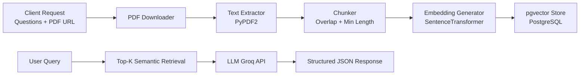

# DocuQueryAI  
**LLM-Powered Intelligent Query–Retrieval Backend**  
*Built for HackRx 6.0 – Bajaj Finserv's Annual Hackathon*


---

## 📜 Overview

**DocuQueryAI** is a backend system that can **process large documents** (insurance policies, contracts, compliance documents) and **answer natural language questions** with high accuracy.  

It uses **semantic embeddings** and **LLM-based reasoning** to retrieve relevant clauses and provide **explainable decisions** in JSON format.

**Key domains:**  
- 📄 Insurance  
- ⚖️ Legal  
- 🏢 HR  
- ✅ Compliance  

---

## ⚙️ Features

- 📥 **PDF ingestion from URL** (DOCX & emails can be extended easily)
- ✂️ **Smart text chunking** with overlap for context preservation
- 🔍 **Semantic search** with pgvector + SentenceTransformers
- 🤖 **LLM-powered answer generation** via Groq API
- 🧠 **Explainable answers** with traceable context
- 🚀 **Dockerized** for quick deployment

---

## 🏗 Architecture



---

## 🖥 Tech Stack

- **Language:** Python 3.11
- **Framework:** FastAPI
- **Vector DB:** PostgreSQL + pgvector
- **Embeddings:** SentenceTransformers (intfloat/e5-small-v2)
- **LLM:** Groq API (configurable model)
- **Deployment:** Docker, Uvicorn
- **Others:** PyPDF2, psycopg2, dotenv

---

## 📂 Project Structure

```
.
├── api/
│   ├── main.py            # FastAPI app, routing, request handling
│── parser.py             # PDF extraction & text chunking
│── answer_generator.py   # LLM prompt building & Groq API calls
│── db_vector_store.py    # PostgreSQL (pgvector) operations
│── config.py             # Environment & config management
│── embeddings.py         # Standalone embedding generator
├── requirements.txt
├── Dockerfile
└── README.md
```

---

## 🚀 Quick Start

### 1️⃣ Clone the Repository

```bash
git clone https://github.com/yourusername/docuqueryai.git
cd docuqueryai
```

### 2️⃣ Environment Variables

Create a `.env` file in the `api/` directory:

```env
GROQ_API_KEY=your_groq_api_key
BEARER_TOKEN=your_auth_token
LLM_MODEL=llama3-8b-8192

# Database Config
DB_NAME=your_database_name
DB_USER=your_username
DB_PASSWORD=your_db_password
DB_HOST=localhost
DB_PORT=5432

# PDF Processing
CHUNK_SIZE=500
CHUNK_OVERLAP=100
MIN_CHUNK_LENGTH=50
TOP_K_CHUNKS=3
EMBEDDING_DIM=384
```

### 3️⃣ PostgreSQL Setup (Required)

Before running, you must:

**Enable pgvector extension**
In pgAdmin or psql:

```sql
CREATE EXTENSION IF NOT EXISTS vector;
```

**Create the embeddings table**

```sql
CREATE TABLE IF NOT EXISTS document_chunks (
    id SERIAL PRIMARY KEY,
    document_id TEXT,
    chunk_index INT,
    chunk_text TEXT,
    embedding vector(384) -- Dimension must match your model
);
```

### 4️⃣ Install Dependencies

```bash
pip install -r requirements.txt
```

> ⚠️ **Warning:** These library versions are only compatible with Python 3.11. Creating a virtual environment and installing dependencies within it is highly recommended for your usage.

**Recommended approach:**
```bash
# Create virtual environment
python3.11 -m venv venv

# Activate virtual environment
# On Windows:
venv\Scripts\activate
# On macOS/Linux:
source venv/bin/activate

# Install dependencies
pip install -r requirements.txt
```

### 5️⃣ Run Locally

```bash
uvicorn main:app --reload --port 8000
```

### 6️⃣ Run with Docker

```bash
docker build -t docuqueryai .
docker run -p 10000:10000 --env-file api/.env docuqueryai
```

---

## 📋 API Usage

### Health Check

```bash
GET /health
```

**Response:**

```json
{
  "status": "healthy",
  "details": { 
    "pgvector": "healthy" 
  }
}
```

### Run Query

```bash
POST /hackrx/run
Authorization: Bearer <BEARER_TOKEN>
Content-Type: application/json
```

**Request Body:**

```json
{
  "documents": "https://example.com/policy.pdf",
  "questions": [
    "Does this policy cover knee surgery?",
    "What are the exclusions?"
  ]
}
```

**Response:**

```json
{
  "answers": [
    "Yes, knee surgery is covered under clause 4.2 with pre-authorization.",
    "Exclusions include cosmetic surgery, pre-existing conditions..."
  ]
}
```

---

## 🔮 Future Enhancements

- Support for DOCX, email (.eml) parsing
- Multi-document query support
- Fine-tuned domain-specific LLM
- Web-based frontend interface

---

## 📜 License

This project is licensed under the MIT License – see the [LICENSE](LICENSE) file for details.

---

## 🤝 Contributing

1. Fork the repository
2. Create your feature branch (`git checkout -b feature/AmazingFeature`)
3. Commit your changes (`git commit -m 'Add some AmazingFeature'`)
4. Push to the branch (`git push origin feature/AmazingFeature`)
5. Open a Pull Request

---
